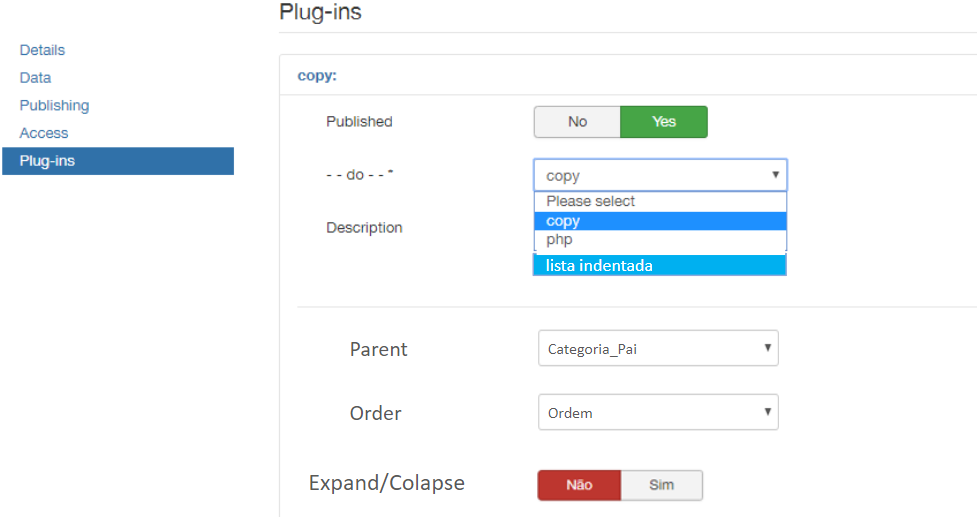
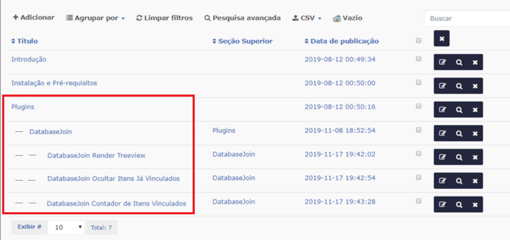
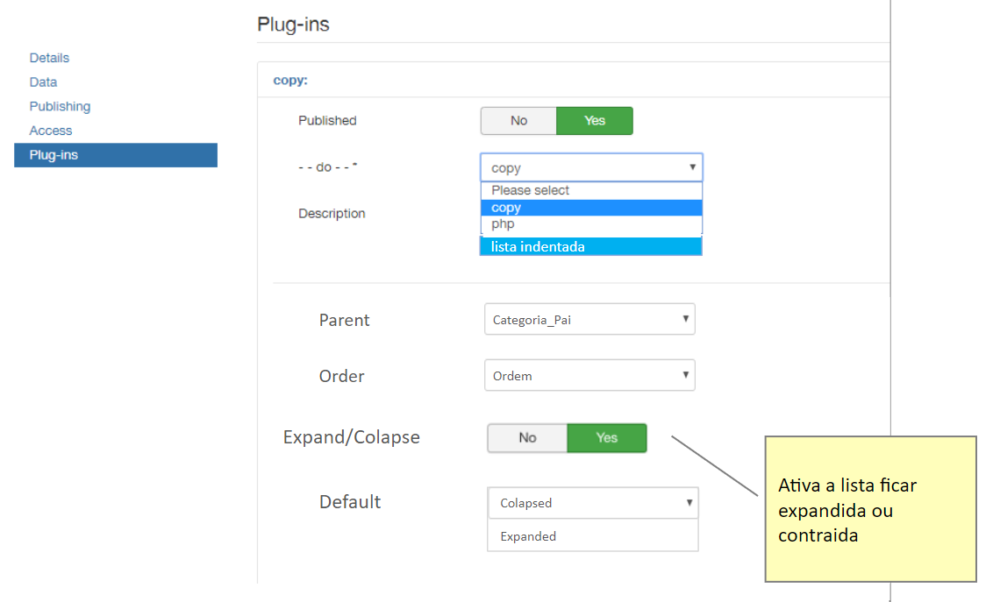
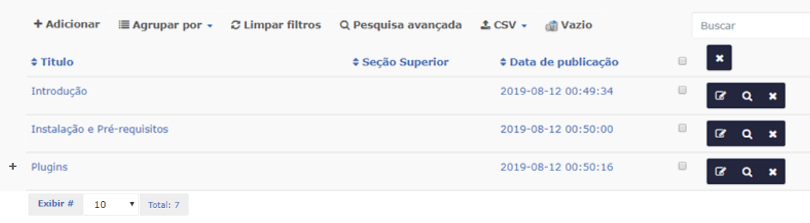

# Recursive Tree

  

## Sobre

É um plugin de lista que organiza os registros permitindo mostrá-los em hierarquia no estilo "Tree Files". O plugin também permite arrastar e soltar os elementos da lista permitindo reorganizá-los de forma hierárquica. Permite arrastar e soltar para alterar a posição dos itens.

## Listagem Identada

Primeiramente deve-se configurar o plugin selecionando a opção "Lista Identada", no campo Parent selecionar o elemento que será utilizado como item pai e logo após selecionar a ordem a ser obedecida. A lista com o plugin desabilitado exibirá os dados com todos os itens igualmente categorizados como na imagem abaixo: 

  

 

Após a configuração e seleção de qual item será organizado como pai, os itens serão exibidos conforme figura abaixo:  

  

 

## Listagem expandida/contraída

Para este modo, basta apenas ativar a opção Expand/Colapse e na opção Default selecionar qual vai ser o modo de exibição padrão quando a lista for carregada expandida ou contraída como na imagem à seguir: 

  

 

Desta forma será possível contrair ou expandir os elementos filhos utilizando o ícone "+" no inicio da lista:

  

